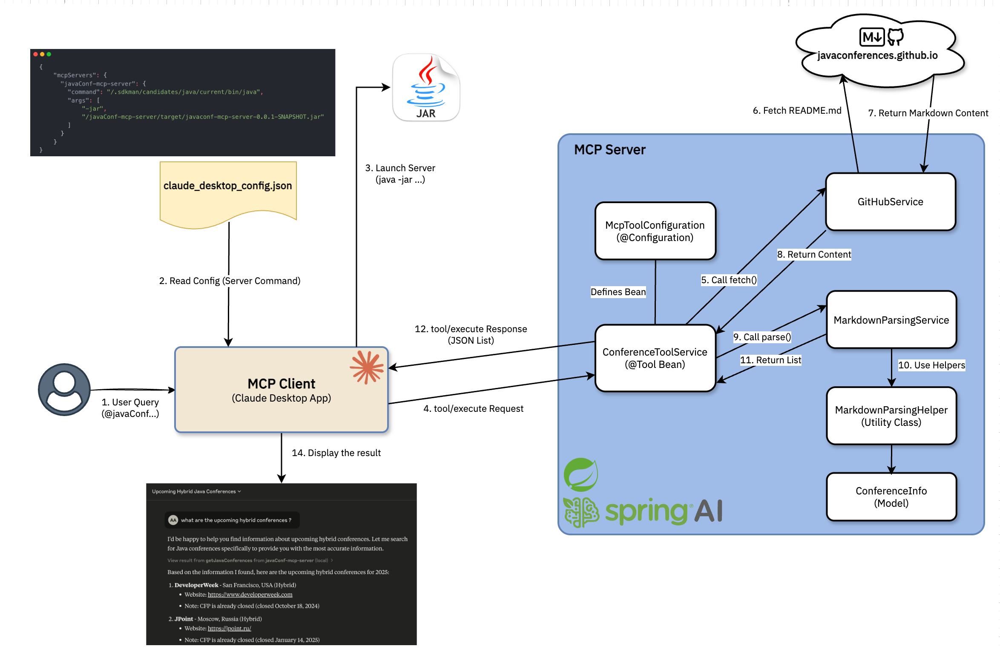
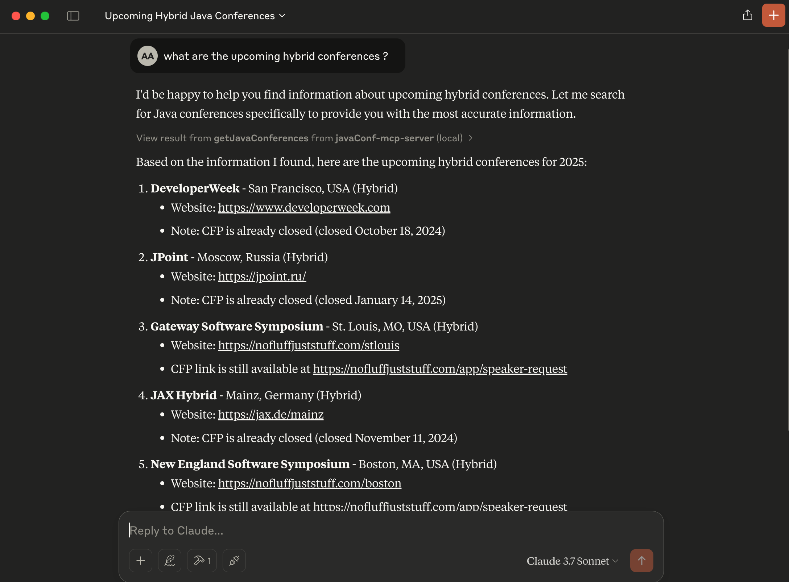

# 🔌 Java Conferences MCP Server 🔌

A Model Call Protocol (MCP) server that provides AI assistants with access to data about Java conferences from around the world. This server exposes conference information from a public GitHub repository including names, dates, locations, and Call for Papers (CFP) details through a standardized MCP interface.

## Data Source
The server fetches data by parsing the `README.md` file from the [🔗 javaconferences/javaconferences.github.io](https://github.com/javaconferences/javaconferences.github.io) repository.
The specific URL is configured in `application.properties` and defaults to:
`https://raw.githubusercontent.com/javaconferences/javaconferences.github.io/main/README.md`

## Provided Tool
*   **Name:** `getJavaConferences`
*   **Description:** Get information about Java conferences for a specific year (if specified and found in the source) or the current year by default. Parses data for all years found under H3 headings in the source markdown file.
*   **Input Parameter:**
    *   `year` (String, Optional): The 4-digit year to retrieve conferences for. If omitted or invalid, defaults to the current year.
*   **Output:** A list of JSON objects, each representing a conference with the following fields:
    *   `conferenceName` (String)
    *   `date` (String)
    *   `location` (String)
    *   `isHybrid` (Boolean)
    *   `cfpLink` (String) - URL for the Call for Papers, if available
    *   `cfpDate` (String) - Closing date for CFP, if available
    *   `link` (String) - Main conference link
    *   `country` (String)


## MCP Server Architecture



## Configuration

## Connecting an MCP Client (e.g., Claude Desktop)

To connect an MCP client like Claude Desktop to this server:

1. Configure your MCP client to connect to the server. For Claude Desktop, you might update your `claude_desktop_config.json` file like this:

    ```json
    {
    "mcpServers": { 
      "javaConf-mcp-server": {
        "command": "java",
        // "command": "PATH_TO_USER/.sdkman/candidates/java/current/bin/java", /* in my case i'm using the java version installed by sdkman */
        "args": [
            "-jar", 
            "PATH_TO_PROJECT/javaConf-mcp-server/target/javaconf-mcp-server-0.0.1-SNAPSHOT.jar"
        ]
      }
    }
    }
    ```

2. Start the MCP client and ensure that it is connected to the server.
3. Use the tool by asking questions like:
    - "What are the upcoming Java conferences?"
    - "What are hybrid conferences?"
    - "Give the CPF link of Jfokus conference to submit a talk"

### Example of a conversation with the MCP server



## Tech Stack

- **[`🍃️ Spring Boot`](https://spring.io/projects/spring-boot)**
- **[`🤖️ Spring AI`](https://spring.io/projects/spring-ai)**
- **[`🔌 Spring AI MCP`](https://docs.spring.io/spring-ai/reference/api/mcp/mcp-server-boot-starter-docs.html)**
- **[`📦️ Maven`](https://maven.apache.org/)**
- **[`🧾 CommonMark`](https://commonmark.org/)**

## Support

- ⭐️️ Star this repository if you find it useful.
- 🐛️ If you find a bug, raise an issue or fix it and send a pull request.
- 📢️ If you have any feature requests, raise an issue or send a pull request.
- 🤲 If you have a moment, don't forget to make a duaa for me and my parents.
